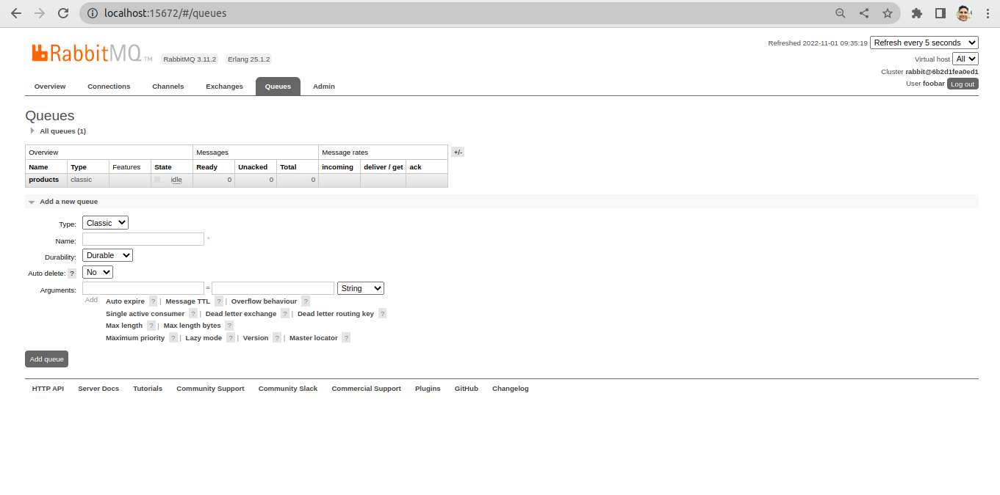
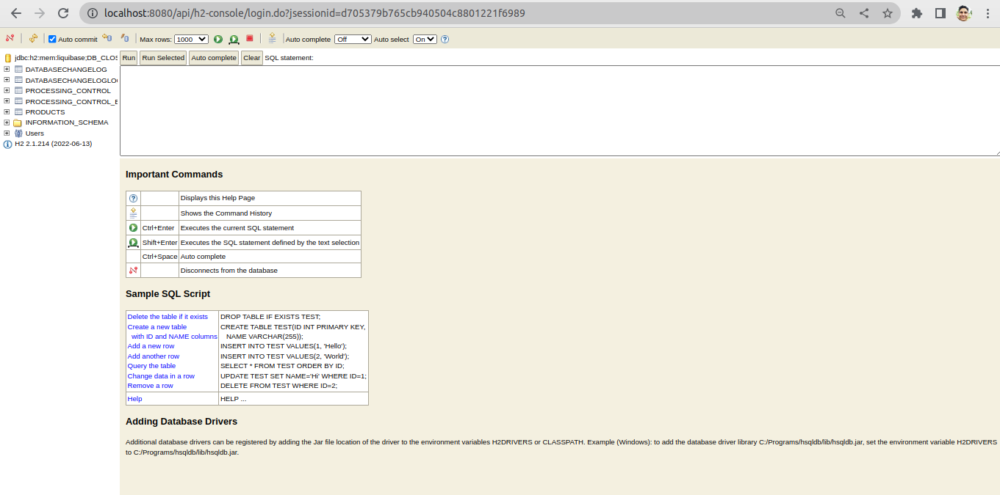
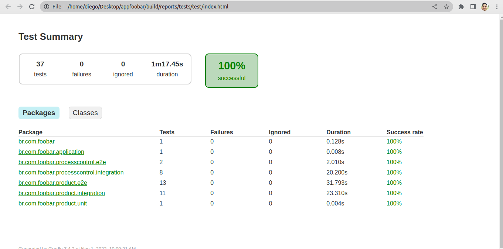
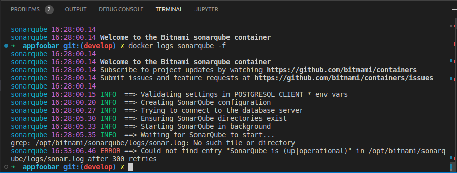
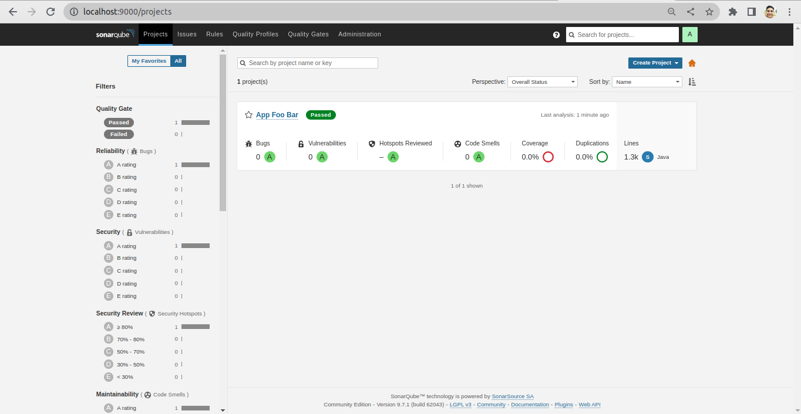

# Aplicação de Gerenciamento de Produtos

## 📑 Sobre o projeto

Este projeto tem objetivo disponibilizar uma api que possibilita o envio de um arquivo para validar,
processar e armazenar os registros de produtos em um banco de dados. 

Após o fluxo de processamento e armazenamento dos dados do arquivo, é possível através da api consultar,
atualizar e deletar os registros cadastrados.

## ✍🏻 Requisitos funcionais

A api deve receber um arquivo no formato '.csv', coonforme o modelo a seguir:

        lm;name;free_shipping;description;price;category
        1001;Furadeira X;0;Furadeira eficiente X;100.00;123123
        1002;Furadeira Y;1;Furadeira super eficiente Y;140.00;123123
        1003;Chave de Fenda X;0;Chave de fenda simples;20.00;123123
        1008;Serra de Marmore;1;Serra com 1400W modelo 4100NH2Z-127V-L;399.00;123123
        1009;Broca Z;0;Broca simples;3.90;123123
        1010;Luvas de Proteção;0;Luva de proteção básica;5.60;123123

A api deve receber um arquivo no padrão informado anteriormente e validar o tipo do arquivo enviado. Se o arquivo estiver no padrão
correto, ele é encaminhado para um message broker RabbitMQ e é retornado um código de rastreio para o acompanhamento do processamento.

Após o envio do arquivo para o serviço de mensageria, o sistema tem a responsabilidade de consumir
o arquivo enviado, validar o conteúdo e processar para armazenar no banco de dados relacional.

O sistema também deve disponibilizar um endpoint, permitindo que seja verificado se o arquivo encaminhado
foi processado ou não. Para essa funcionalidade deve ser encaminhado o códido de rastreio obtido no momento
de envio.

## 🛠 Requisitos técnicos

Para desenvolvimento do sistema foram utilizados os seguintes frameworks, bibliotecas e serviços:

- Framework Spring Boot
- Banco de dados H2 para teste e desenvolvimento e postgres como produção
- Junit para os testes de unitários, integrações e end2end
- Swagger como documentação da API
- RabbitMQ como message broker (Queue)
- SonarQube para avaliação de códigos
- Docker Container

## 🖥 Configurando ambiente

### Executando localmente

## Pré-requisitos

Antes de começar, verifique as instalações e configurações dos seguintes requisitos:

* Instalação Java 11 + 
+ Gradle version 7+
* Docker e Docker Compose

##### Clone do repositório
```
git clone git@github.com:diego-viana-ferreira/appfoobar.git
```

##### Acesse o diretório do projeto
```
cd appfoobar
```

##### Executar o comando gradle para construir a aplicação
```
gradle build
```

##### Antes iniciar a aplicação é necessário o message broker estar em disponível. Para facilitar esta operação é necessário executar o comando docker compose
```
docker-compose -f docker-compose-only-rabbitqm.yml up -d
```

> Screenshot do serviço RabbitMQ executando na porta 15672

* username: foobar
* password: An33ytG3Hln#




##### Executando o projeto localmente com profile desenvolvimento
```
java -jar build/libs/AppFooBar-1.0.0.jar --spring.profiles.active=dev
```

> Screenshot da documentação da API, utilizando a biblioteca Swagger
executando no endereço: http://localhost:8080/api/swagger-ui/index.html


> Screenshot do banco de dados H2 em memória para desenvolvimento,
  disponível em: http://localhost:8080/api/h2-console

* username: sa
* password: 



### Executando testes e avaliação dos códigos

##### Continuando no diretório raiz do projeto, use o comando gradle para testar a aplicação

```
gradle test
```
> Screenshot do resultado dos tests, disponível no diretório: $PATH/appfoobar/build/reports/tests/test



##### O SonarQube pode ser utilizado para analisar e avaliar os códigos desenvolvidos. O comando a seguir deve iniciar o serviço (pode levar alguns minutos)

```
docker-compose -f docker-compose-only-sonarqube.yml up -d
```

##### Possíveis problemas

* Caso o container não carregue corretamente em sistema linux, conforme a evidência abaixo:


Execute o comando para alterar a propriedade 'max_map_count' do sistema operacional, para que o serviço seja inicializado com sucesso

```
sudo sysctl -w vm.max_map_count=262144
```

Após alteração aplicada, deve ser  executado novamente o comando docker compose

```
docker-compose -f docker-compose-only-sonarqube.yml up -d
```

##### Assim que o SonarQube estiver em operação, pode ser executado o seguinte comando para iniciar o processo de avaliação dos códigos

```
gradle sonarqube
```

> Screenshot do SonarQube em execução e demostração do resultado disponível no endereço: http://localhost:9000

* username: foobar
* password: o4^SP48o7^#3



### Executando com um único Docker Compose "Produção"

##### Caso não seja necessário configurar o ambiente para desenvolvimento e deseje apenas disponibilizar a aplicação, é possível iniciar toda a stack necessária com um único comando

```
docker-compose up -d --remove-orphans
```

- NOTA: os serviços banco de dados H2 e SonarQube que foram utilizados apenas no desenvolvimento não estarão disponíveis, já o serviço de mensageria RabbitMQ estará disponível no mesmo endereço e porta mencionados anteriormente, e a aplicação da API estará disponível na porta padrão 80: http://localhost/api/swagger-ui/index.html com banco de dados postgres


Obrigado e qualquer dúvida estou a disposição. 🤝
